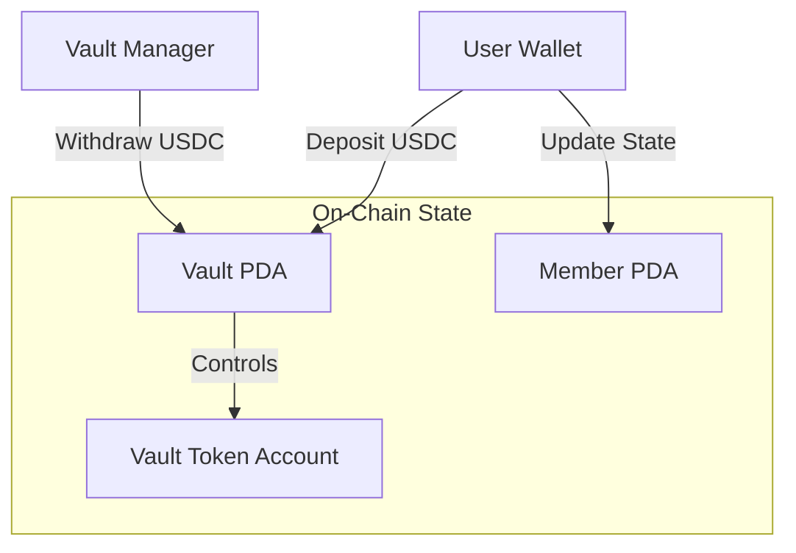

# NexaPay Savings Program

## Overview
**NexaPay Savings** is a modular, high-security Solana Anchor program designed to facilitate group savings vaults. It serves as the on-chain primitive for the NexaPay financial ecosystem, allowing users to pool funds securely with transparent contribution tracking and authority-governed withdrawals.

## Features
- **🛡️ Secure PDA Vaults**: Each vault is a Program Derived Address (PDA) managing specific SPL Tokens (e.g., USDC).
- **🪙 SPL Token Support**: Built from the ground up to support any SPL Token.
- **📊 Granular Contribution Tracking**: Each member's deposits are tracked in individual Member PDAs.
- **🔑 Controlled Withdrawals**: Only the initialized authority can withdraw funds.
- **📝 Durable Nonce Compatible**: Fully compatible with Solana's Durable Nonces for offline transaction signing.

## Architecture

The program follows a modular architecture separating state, instructions, and business logic.



## Durable Nonces & Offline Signing
This program is fully compatible with **Durable Nonces**, allowing for offline signing of transactions.

**Workflow:**
1. **Online**: Create a Nonce Account.
2. **Offline**: 
   - Construct the `deposit` or `withdraw` transaction.
   - Fetch the nonce hash (previously query).
   - Sign the transaction with the Authority/User key.
3. **Online**: Submit the transaction at any time.

This feature is critical for high-security setups where the Authority key is kept in cold storage.

## Installation & Testing

### Prerequisites
- Rust & Cargo
- Solana CLI
- Anchor CLI

### Build
```bash
anchor build
```

### Test
```bash
anchor test
```

## Instructions

### 1. Initialize
Creates a new Vault PDA for a specific Mint.
- **Seeds**: `[b"vault", authority, mint]`

### 2. Deposit
A user transfers SPL Tokens to the Vault.
- **Seeds**: `[b"member", vault, user]`

### 3. Withdraw
The authority withdraws tokens from the Vault to a recipient.
- **Checks**: 
  - Signer must be the Vault authority.
  - Vault must have sufficient funds.

## License
MIT
