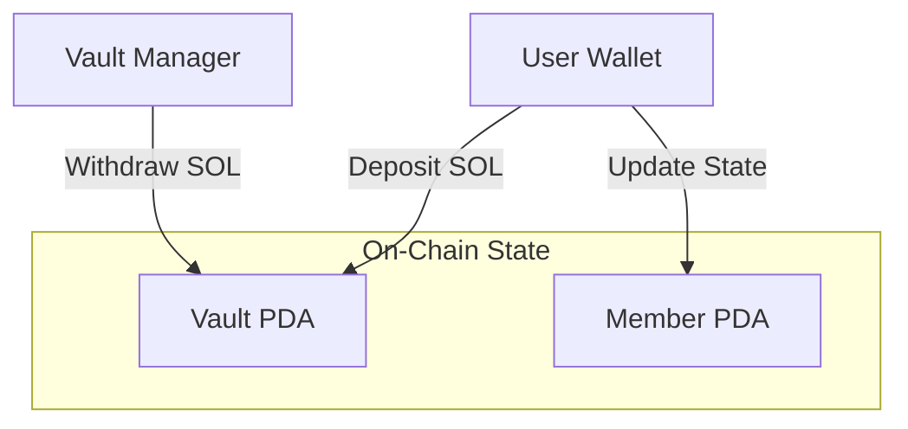

# NexaPay Savings Program

## Overview
**NexaPay Savings** is a modular, high-security Solana Anchor program designed to facilitate group savings vaults. It serves as the on-chain primitive for the NexaPay financial ecosystem, allowing users to pool funds securely with transparent contribution tracking and authority-governed withdrawals.

## Features
- **🛡️ Secure PDA Vaults**: Each vault is a Program Derived Address (PDA), ensuring funds are only managed by the program.
- **busts Multi-User Deposits**: unlimited users can deposit into a single vault.
- **📊 Granular Contribution Tracking**: Each member's deposits are tracked in individual Member PDAs.
- **🔑 Controlled Withdrawals**: Only the initialized authority can withdraw funds, preventing unauthorized access.
- **⚡ High Performance**: Built on Solana using the Anchor framework for safety and speed.

## Architecture

The program follows a modular architecture separating state, instructions, and business logic.



### Directory Structure
```
programs/nexapay-savings/src/
├── lib.rs              # Entry Point & Routing
├── constants.rs        # Global Constants (Seeds)
├── errors.rs           # Custom Error Definitions
├── events.rs           # Event Emissions
├── state/              # Account Structures
│   ├── vault.rs        # Vault Account Definition
│   └── member.rs       # Member Account Definition
└── instructions/       # Business Logic
    ├── initialize.rs   # Create Vault
    ├── deposit.rs      # User Deposit Logic
    └── withdraw.rs     # Authority Withdrawal Logic
```

## Data Structures

### Vault Account
Stores global stats for a savings group.
- `authority`: Manager public key.
- `total_deposited`: Aggregate SOL amount.
- `member_count`: Number of unique contributors.

### Member Account
Tracks individual contributions.
- `vault`: Reference to the parent vault.
- `authority`: The member's wallet.
- `deposited_amount`: Total SOL contributed by this member.

## Installation & Testing

### Prerequisites
- Rust & Cargo
- Solana CLI
- Anchor CLI

### Build
```bash
anchor build
```

### Test
```bash
anchor test
```

## Instructions

### 1. Initialize
Creates a new Vault PDA owned by the caller.
- **Seeds**: `[b"vault", authority]`

### 2. Deposit
A user sends SOL to the Vault. This creates or updates their Member PDA.
- **Seeds**: `[b"member", vault, user]`

### 3. Withdraw
The authority withdraws funds from the Vault to a recipient.
- **Checks**: 
  - Signer must be the Vault authority.
  - Vault must have sufficient funds.

## License
MIT
